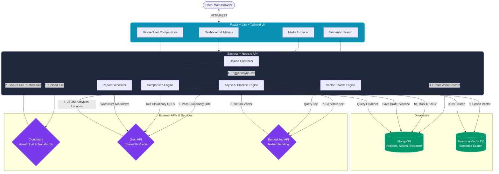
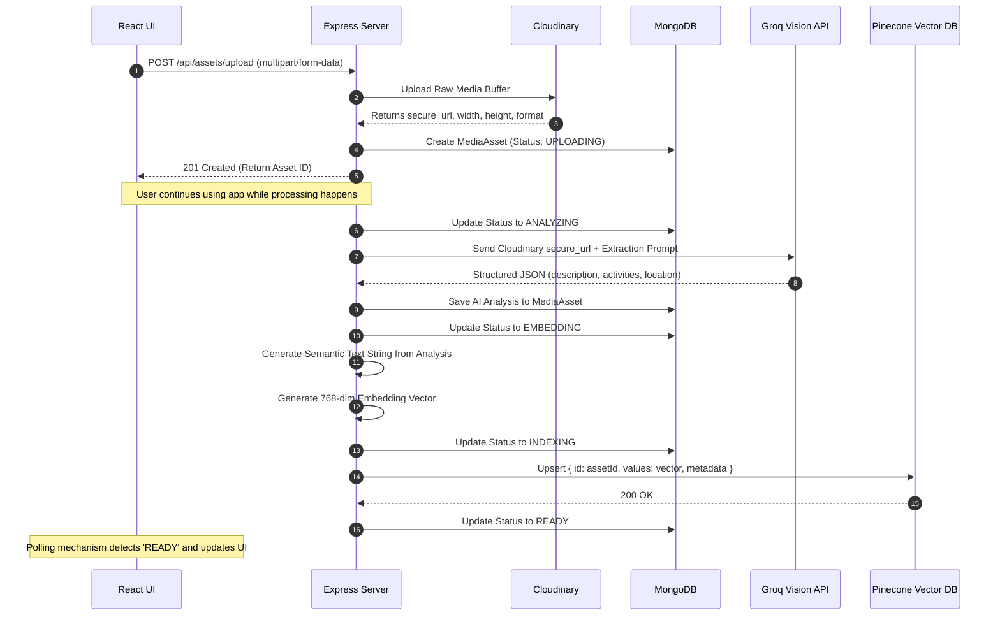

# Canopi: AI-Powered Impact & Sustainability Media Platform

## 1. Problem Statement & Overview
NGOs, governments, and sustainability organizations generate massive volumes of unstructured photos and videos from field projects (e.g., environmental cleanups, infrastructure development). 
Manually organizing, verifying, and extracting meaningful stories from this raw media is incredibly time-consuming. **Canopi** solves this by acting as an AI-powered media intelligence engine. It leverages **Cloudinary** for robust media handling, **Groq** for high-speed vision AI, and **Pinecone** for semantic search, instantly turning raw field photos into structured evidence, verifiable before/after comparisons, and campaign-ready impact reports.

---

## 2. System Architecture Diagram

---

## 3. The Core Media Processing Pipeline (Execution Flow)

The heart of the application is the asynchronous media processing pipeline. Because large AI models take time to evaluate images, the platform is designed to respond immediately and process data in the background.

## 4. Key Execution Modules Explained

### A. Semantic Search Module
Instead of exact keyword matching (which fails when users type "water cleanup" but the image is tagged "river pollution"), we use Semantic Search.
1. The user types a natural language query in the UI.
2. The query is converted into a mathematical vector using an embedding model.
3. We query **Pinecone** using Cosine Similarity to find the closest matching vectors.
4. Pinecone returns the `assetId`s, which we use to fetch the full records from **MongoDB**.

### B. Visual Evidence Comparison
1. The user selects a "Before" image (baseline) and an "After" image (outcome).
2. The `comparison.controller.js` retrieves both **Cloudinary** secure URLs.
3. Both URLs are passed simultaneously to the **Groq Vision model**, prompting it to act as an environmental auditor.
4. The AI returns a JSON array of `observations` (e.g., "The riverbank in image A contains debris, image B shows newly planted vegetation").
5. This JSON is packaged into an `Evidence` object and stored in the database to guarantee immutability.
